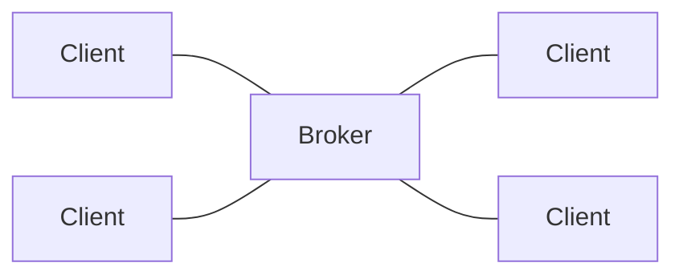

# MQTT
RSMP 4 is build on top of [MQTT](https://mqtt.org/). MQTT is based on a publish-subscribe model with a broker in the middle and topic paths as a flexible way to route and filter message.

## Broker
With MQTT, all clients connect to a central broker, which routes messages basd on topics paths:

The architecture makes it possible for clients to communicate with all other clients, via the broker. However, you can setup access control on the broker when needed.

There is no inherent idea of a site vs. supervisor side in MQTT, it's all just clients connecting to the broker. In RSMP 4 clients are known as _nodes_.

## Topic Paths
MQTT uses topic paths as a fundemental concept. A topic path is string using forward slashes as delimiters.

RSMP 4 uses a **Device-Centric** topic layout:

`<../../node>/type/code[/<component>]`

### Sections

| Section | Description | Format | Example |
| :--- | :--- | :--- | :--- |
| **Node ID** | Unique Device Identifier including optional hierarchy prefix. | [../../]node | `dk/cph/tlc-001` |
| **Type** | Protocol Keyword / Parsing Anchor. | Fixed Enum | `command`, `status`, `alarm`, `presence` |
| **Code** | Message Code (from SXL). Flattened to avoid ambiguity. | Dotted String | `tlc.plan.set` (derived from `tlc/plan/set`) |
| **Component** | Logic resource path. | Slashed String | `sg/1` |

The node id can consist of 1 or more levels, e.g. `af5g`, `zone1/tlc-001` or `dk/cph/tlc-001`. Using the same number of levels for all devices in a setup is recommended, but not required. 

### Examples

`dk/cph/tlc-001/command/tlc.plan.set`
`dk/cph/tlc-001/status/tlc.plan.status`

### Wildcards

"#" (hash sign) is used to match multiple levels in the hierarchy.

This layout allows easy subscription to all messages for a specific device or area:

- All messages for a specific device: `dk/cph/tlc-001/#`
- All messages for a region: `dk/cph/#`

"\\+" (plus sign) is used to match a single level in the hierarchy.

- All status messages for a device: `dk/cph/tlc-001/status/#`

