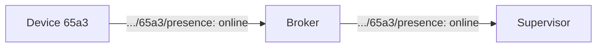
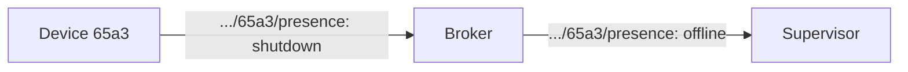
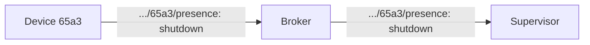

# Presence
Used when nodes come online or go offline.

```
<node>/presence
```

Examples:
```
45fe/presence
```

## Connect
After connecting, a node publishes to `<node>/presence`, with a payload set to "online": 



## Disconnect
An unexpected disconnect is handled using Last Will. When connecting to the broker, the site sets Last Will and Testament (LWT), which will be published by the broker on behalf of the site, in case he site is disconnected. The topic `<node>/presence` is used, with the payload set to "offline":



More about Last Will:
https://www.hivemq.com/blog/mqtt-essentials-part-9-last-will-and-testament/


## Shutdown
A planned disconnect (e.g. if the device chooses to power down to to a low battery, or a manual shutdown) can be handled by the device posting to `<node>/presence` with payload set to "shutdown", then disconnecting.



## Retained messages
Messages publishing to `<node>/presence` should be retained. When a node connects, and wants the status of other nodes, it subscribes `+/presence` (for a region). It will then immediately get the latest presence known by the broker, for all nodes.
