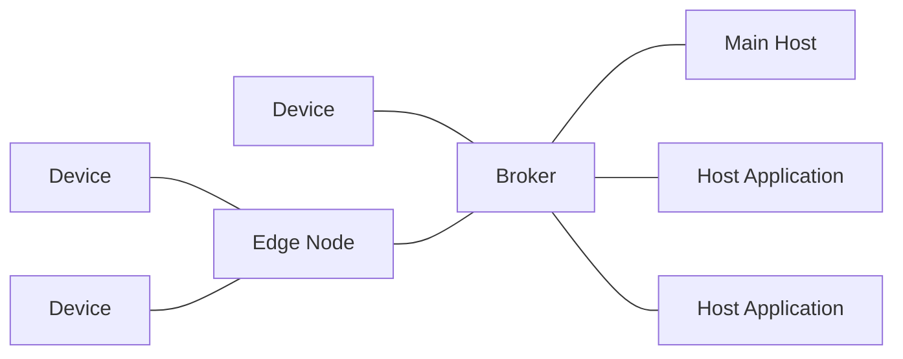
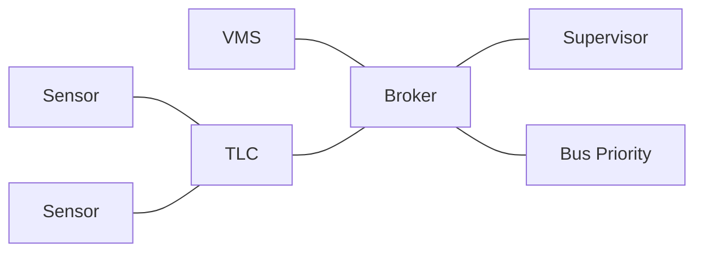

# RSMP 4 based on SparkPlug?

This is s look at how the TLC SXL might be modelled using SparkPlug.


## Archtecture
SparkPlug is based on MQTT but defines some roles:



A TLC would be either a Edge Node, if it handles connection to other devices, like sensors.
Or as a Device if it has no connected devices.

The Traffic Management system / Supervisor system would the the main host. Other systems like a bus priority system would be a host application.




## Primitives
SparkPlug sends data from device to the host, and commands from the host to device.
All data is send as soon as it changes, and there is no concept of subscription.
Everthing else must be build on these primitives, including alarms, commands response, etc.


## Data types
SparkPlug has all the basic types, and allow you to define Templates for your own complex data structures.

RSMP 3 message attribute can either by split into separate metricas, or we can define templates that include several (or all).


## Components
SparkPlug topic path refer to the id of the device, without any notion of componets, e.g.:
`spBv1.0/Sparkplug B Devices/NCMD/Raspberry Pi`

However metric name consists of paths separated by slashes, and can be used to refer to individual physical or logical elements, like inputs/outputs:
`Outputs/LEDs/Yellow`

These metric paths can be used to model RSMP components:

component/module/..             aspects you can read (status) and write (command)
component/module/../response    command responses (read only)
component/module/../alarm       alarms (read only)


## Status
### Subscription
As SparkPlug has no concept of subscriptions, all data is send as soon as it changes. However, we can define when a particular metric changes. For example, we can define an aggregated metric that changes only every minute, if that's useful. We can also use commands to start, stop or otherwise control data stream, as long as we keep in mind that data metrics can be used by any host; you don't have individual subscription settings per supervisor.

Metric can have simples types, or you can define your own templates for more complex types.
The metric will 


### Status Requests and Response
As all data is send as soon as it changes, status requests are not needed.
Also all data is send when the main host (re)connects, which should guarantee that it updated data.
Presumably, the metric is resend when any part of the data structure changes? Although it might be up to use to define/decide when it's resend?

### S0014
This status is used to send the current time plan, and has these attributes:

status (integer): the time plan
source (string): who changd to this timeplan (calender, operator, etc)

Example RSMP 3 message:

```json
{
     "mType":"rSMsg",
     "type":"StatusResponse",
     "mId":"ff9d1115-4463-40be-b3cd-77383489e594",
     "ntsOId":"KK+AG0503=001TC000",
     "xNId":"",
     "cId":"KK+AG0503=001TC000",
     "sTs":"2019-09-26T13:19:26.671Z",
     "sS":[{
             "sCI":"S0014",
             "n":"status",
             "s":"9",
             "q":"recent"
     },{
             "sCI":"S0014",
             "n":"source",
             "s":"forced",
             "q":"recent"
     }]
}
```

Sparkplug/RSMP 4:
```json
{
  "timestamp": 1486144502122,
  "metrics": [{
    "name": "tc/tlc/timeplan",
    "timestamp": 1486144502122,
    "dataType": "Integer",
    "value": 1
  },{
    "name": "tc/tlc/timeplan/source",
    "timestamp": 1486144502122,
    "dataType": "String",
    "value": "calendar"
  }],
  "seq": 0
}
```

Note that 'status' or the number 14 is not included in the metric name. This is because when you change time plan, you write to the same metric.

Status and source are split into separate metrics, because when changing time plan, you set only the plan, not the source. The source would be set by the device.

### S0001
Used for sending live status of all signal groups.

A challenge with this status is that it can generate a lot of data, which is not always needed.
It also relies on an implicit ordering of signal groups and their component ids.


Example RSMP 3 message:
```json
{
  "mType":"rSMsg",
  "type":"StatusResponse",
  "mId":"e8c14802-e4a0-47b7-b360-c0e611718387",
  "ntsOId":"KK+AG0503=001TC000",
  "xNId":"",
  "cId":"KK+AG0503=001TC000",
  "sTs":"2019-09-26T13:00:51.642Z",
  "sS":[{
    "sCI":"S0001",
    "n":"signalgroupstatus",
    "s":"FF3FFF0",
    "q":"recent"
  },{
    "sCI":"S0001",
    "n":"cyclecounter",
    "s":"76",
    "q":"recent"
  },{
    "sCI":"S0001",
    "n":"basecyclecounter",
    "s":"0",
    "q":"recent"
  },{
    "sCI":"S0001",
    "n":"stage",
    "s":"2",
    "q":"recent"
  }]
}
```


Sparkplug/RSMP 4:
```json
{
  "timestamp": 1486144502122,
  "metrics": [{
    "name": "tc/tlc/cyclecounter",
    "timestamp": 1486144502122,
    "dataType": "Integer",
    "value": 24
  },{
    "name": "tc/tlc/basecyclecounter",
    "timestamp": 1486144502122,
    "dataType": "Integer",
    "value": 12
  },{
    "name": "tc/tlc/stage",
    "timestamp": 1486144502122,
    "dataType": "Integer",
    "value": 2
  },{
    "name": "tc/tlc/signalgroupstatus",
    "timestamp": 1486144502122,
    "dataType": "Template",
    "value": {
      "cycle_milliseconds": 24300,
      "signalgroupstatus": "FF3FFF0"
    }
  }],
  "seq": 0
}
```

The normal cyclecounter metrics use integers and would update every second.

(If we know that the TLC is synchronized using NTP and we know the cycle length and it's well define how the cycle counter is computed, e.g. based on Unix time, is it even needed? Or could we send an update just when it restarts from 0? That would save a lot of updates.)

When the signal group status change we would like to provide the precise cycle counter in milliseconds, but we don't want to trigger a data message every milliseconds.

To handle this, we define the signalgroupstatus metric as a hash that includes the cycle counter in milliseconds and the signal groups status. We would send it only when the signal group state changes, not every millisecond. This would be similar to the RMSP 3 idea of marking the cycle_milliseconds as a lean attribute, which is send along when something else changes, but does not itself trigger an update.


We can define a sub metric that you can send commands to to turn on/off the signalgroupstatus, or set update intervals, etc:

```json
{
  "timestamp": 1486144502122,
  "metrics": [{
    "name": "tc/tlc/signalgroupstatus/throttle",
    "timestamp": 1486144502122,
    "dataType": "Boolean",
    "value": false
  }]
}
```


## Command
With sparkplug, commands write to metrics. When succesfull, the device should send data update with the update metric. This works a simple type of command response.

But we can define additional metricss to provide other responses, like progress status or error messages, if needed.


### M0002
Used for switching time plan.

RSMP 3 example:
```json
{
     "mType":"rSMsg",
     "type":"CommandRequest",
     "mId":"5066622c-cd03-44c2-9e21-dd02d8998585",
     "ntsOId":"KK+AG0503=001TC000",
     "xNId":"",
     "cId":"KK+AG0503=001TC000",
     "arg":[{
             "cCI":"M0002",
             "n":"status",
             "cO":"setPlan",
             "v":"True"
     },{
             "cCI":"M0002",
             "n":"securityCode",
             "cO":"setPlan",
             "v":"0000"
     },{
             "cCI":"M0002",
             "n":"timeplan",
             "cO":"setPlan",
             "v":"1"
     }]
}
```

Sparkplug/RSMP 4:

```json
{
  "timestamp": 1486144502122,
  "metrics": [{
    "name": "tc/tlc/timeplan",
    "timestamp": 1486144502122,
    "dataType": "Integer",
    "value": 2
  }]
}
```

Note that you write to the same metric that report the current time plan (S0014)
So intead organizing by status and commands, we actually organizing around states (e.g timeplan) and you can read it (status) and set it (command).

If the timeplan was succesfully changed a data update will be send back reporting the plan number in tc/tlc/timeplan, and the source in tc/tlc/timeplan/source.

Progress and errors will be reported with:

```json
{
  "timestamp": 1486144502122,
  "metrics": [{
    "name": "tc/tlc/timeplan/response",
    "timestamp": 1486144502122,
    "dataType": "Template",
    "value": {
      "status:": "working",
      "message": "Switch to plan 2 initiated."
    }
  }]
}
```

```json
{
  "timestamp": 1486144502122,
  "metrics": [{
    "name": "tc/tlc/timeplan/response",
    "timestamp": 1486144502122,
    "dataType": "Template",
    "value": {
      "status:": "ok",
      "message": ""
    }
  }]
}
```

```json
{
  "timestamp": 1486144502122,
  "metrics": [{
    "name": "tc/tlc/timeplan/response",
    "timestamp": 1486144502122,
    "dataType": "Template",
    "value": {
      "status:": "error",
      "message": "Cannot switch to plan 3 as it does not exist."
    }
  }]
}
```

## Alarms
We would define a metric for each alarm. When the alarm changes the metric is send using the regular data mechanism.
If we still want the ability to block/confirm alarms, this can be handled by commands.

We report errors as part of the entities we use for statuses and commands.

### A0008
Used to report a deadlock error, i.e. a problem with the time plan.

RSMP 3:
```json
{
     "mType":"rSMsg",
     "type":"Alarm",
     "mId":"148c4a38-d0ca-4a5e-81d4-951bcfc14df8",
     "ntsOId":"KK+AG0503=001TC000",
     "xNId":"",
     "cId":"KK+AG0503=001SG001",
     "aCId":"A0008",
     "xACId":"ERROR DELAY #10",
     "xNACId":"",
     "aSp":"Issue",
     "ack":"notAcknowledged",
     "aS":"Active",
     "sS":"notSuspended",
     "aTs":"2019-09-26T12:51:08.171Z",
     "cat":"D",
     "pri":"2",
     "rvs":[{
             "n":"timeplan",
             "v":"9"
     }]
}
```

Sparkplug/RSMP 4:
```json
{
  "timestamp": 1486144502122,
  "metrics": [{
    "name": "tc/tlc/timeplan/alarm",
    "timestamp": 1486144502122,
    "dataType": "Template",
    "value": {
      "code:": "delay",
      "message": "Error delay #10."
    }
  }]
}
```

When the alarm becomes inactive:

```json
{
  "timestamp": 1486144502122,
  "metrics": [{
    "name": "tc/tlc/timeplan/alarm",
    "timestamp": 1486144502122,
    "dataType": "Template",
    "value": {
      "code:": "ok",
      "message": ""
    }
  }]
}
```


Questions:
How are data templates used exactly?
Is the metric type allowed to change over time?
How are nulls send?
Can intermediate metric names have values? Ie. both fruit and fruit/banana?
