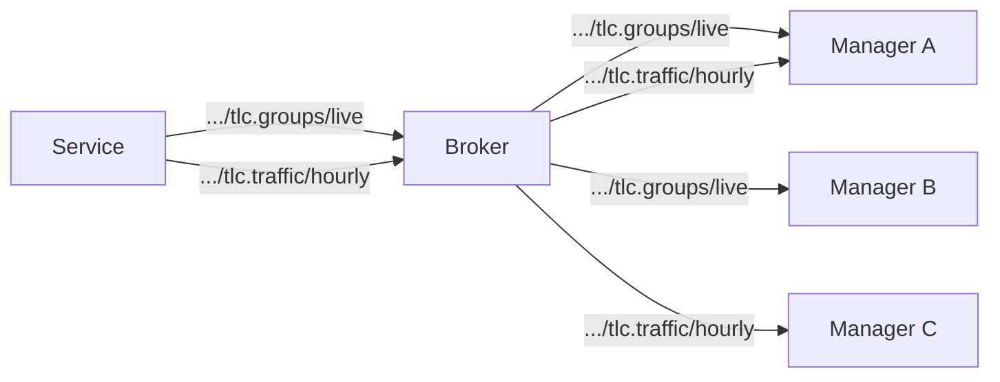

# Status
A status message is sent by a node to inform about status changes.

```
<node>/status/<code>/<channel>
```

The status is identified by a status code and delivered via a configured set of channels,
which define update rate, etc.

If a status has only a single channel, the channel name may be omitted:

```
<node>/status/<code>
```

Examples:
```
45fe/status/tlc.groups/live            # live channel of signal group status
45fe/status/tlc.groups/hourly          # hourly aggregated signal group status
45fe/status/tlc.plan                   # current plan (single channel, name omitted)
45fe/status/traffic.count/hourly       # hourly traffic data
```

## Attributes
A module interface defines status code, including a list of attributes with:
- name
- data type
- description
- annotation

### Annotation flag
If annotation is set to true, changes to the attribute does not trigger partial updates, but will
always be included in partial updates caused by other attributes.

For full updates, the annotation flag is ignored, since all attributes are always included.

A typical example is a timestamp - you want it sent along when another attribute changes, but it does not
by itself trigger updates.

## Channels
Data is delivered via one or more channels which define:

- **Name**: channel name, e.g. `live`
- **Default state**: whether the channel starts automatically (on/off)
- **Full updates**: settings for full updates, including interval and attributes
- **Partial updates**: setting for partial updates, including interval and attributes

Consumers choose which of the preconfigured channels they subscribe to.



Channels can be turned on/off. For example a high-bandwidth channel can be
turned on only when needed.
If all channels for a status are stopped, no data is published for that status.

One or more channels MUST be configured for each status code supported on the node.

A status is not required to have any channel that defaults to on.

## Retaining Updates
The latest complete state of each channel MUST be retained on the broker.
Updates containing only partial or incremental updates MUST NOT be retained on the broker.

A channel can be configured to send both periodic and live data.
This enables sending full update at regular interval to provide a baseline,
and small incremental updates in between. The full updates are retained on the broker,
while the incremental updates are not.

When a consumer connects, if will immedately get the latest retained complete state from the broker.
Partial updates since the retained full state will not be automatically sent to the consumer, but it
can choose to use `fetch` messages to get any missing incremental updates.

## Channel Configuration
Channel configurations are part of the producer and are used to control when and how status
updates are sent. Channel configurations are not transferred via RSMP.

A channel configuration contains:

- default: on or off
- batch: optional batch interval
- full: optional settings for full updates, which are retained
- partial: optional settings for partial updates, which are not retained

A channel MUST define either:
- both full and partial updates
- full updates only
- partial updates only

Channels with only partial updates have no retained state.

### Full Updates
A full update setting contains:
- interval: `live|second|minute|hour|day|week|month|year`
- aggregations: optional list of aggregations

Full update MUST contain all attributes. They are generated:
- When the channel first starts
- According to the **full interval**.

Fixed update windows should be aligned to clock boundaries (e.g. every 15
minutes on the quarter-hour).

If interval is set to `live` a full update is generated whenever an attribute changes,
unless it's an annotation attribute.

### Partial Updates
A partial update setting contains:
- interval: `live` or a interval like `hourly` or `5 minutes`.
- aggregations: optional list of aggregations

Partial updates contain only attributes that actually changed since the last update,
plus any annotation attributes.

For example, a channel with signal groups of a traffic light controller could
send a full update once per minute with the state of all groups,
and partial updates that contain just the changed groups, send immediately
when a group changes.

### Aggregation
Both full and partial update can define aggregations, but not if the interval is set to `live`.
Aggregations are performed for each of the included attributes.

Full updates aggregate over the interval since the last full update.
Partial updates aggregate over the interval since the last full or partial update.

- count: number of events over the interval
- accumulate: the accumulated sum since the start of the current year
- sum: sum over the interval
- max: max over the interval
- min: min over the interval
- avg: average over the interval

If a channel uses full updates with aggregation, and also uses partial updates,
then full updates must contain both aggregated and raw values. The raw values in the full
updates are required as a baseline for the partial updates.

## Batching
If a `batch` interval is set, the node accumulates events and sends them in a single message with
multiple elements in the `entries` array.

Batching does not affect how messages are otherwise generated.
The same updates will be sent (full and partial), in the same order,
just batched. 

## Default State
A channel configured as off by default must be started via a [Throttle](throttle.md)
message before it publishes data. A channel configured as on by default starts
publishing immediately after the node starts up.

## Payload
Status data is placed in the `entries` array, ordered by `seq`.

Status containing raw values:

```json
{
  "type": "partial"
  "entries": [
    {
      "ts": "2026-02-24T10:00:00.000Z",
      "attributes": {"signalgroupstatus": "11111111", "cyclecounter": 42},
      "seq": 123
    },
    {
      "ts": "2026-02-24T10:00:02.000Z",
      "attributes": {"signalgroupstatus": "00000000", "cyclecounter": 44},
      "seq": 124
    }
  ]
}
```

Status contains aggregated values:

```json
{
  "type": "full"
  "entries": [
    {
      "ts": "2026-02-24T10:00:00.000Z",
      "aggregations": { "traffic.speed": {"avg": 36} },
      "seq": 123
    }
  ]
}
```

| Field | Type | Description |
|---|---|---|
| `ts` | ISO 8601 timestamp | The exact time the event occurred |
| `attributes` | object | Status attributes |
| `aggregations` | object | Status attribute aggregations |
| `seq` | integer | Sequence number per channel, incremented by one for each event |

The sequence number allows consumers to detect gaps (missed messages). The
sequence counter resets to zero after a restart.

## Example
A traffic light controller provides the red/green/yellow state of signal groups, and the current signal plan.

### tlc.groups
Red/green/yellow state of signal groups. Attributes:
- groups: a map with the red/green/yellow state of each group
- cycle (annotation): the cycle counter, counting from 0 to the cycle length and then wrapping.

#### tlc.groups/live
This channel provides live updates, useful for a live view in a supervisor.
A full baseline is sent once per minute, containing the state of all signal groups as well as the cycle counter.
Incremental updates are sent immediately when groups change, and contain only the changed groups, as well as the cycle counter.
Because it can deliver frequent updates, it defaults to off.

```yaml
default: off
batch: off
full:
  interval: 1 minute
partial:
  interval: live
```

### tlc.plan
The current signal plan. Attributes:
- plan: identifies the current plan

#### tlc.plan/live
This channel sends the plan as soon as it's changed.
Because updates are infrequent, it defaults to on.

```yaml
default: on
batch: off
full:
  interval: live
```

### traffic.volume
Traffic detections. Attributes:
- bicycle: number of bicycles
- bus: number of busses
- timestamp (annotation): timestamp of detection/aggregation

#### traffic.volume/hourly
Provides the summed and accumulated counts once per hour.
Because update are infrequent, it defaults to on.

```yaml
default: on
batch: off
full:
  interval: 1 hour
  aggregations: sum, accumulated, max
```

#### traffic.volume/live
Provides live detection events as they happen.

Because updates are frequent, it defaults to off.

```yaml
default: off
batch: off
partial:
  interval: live
```

#### traffic.volume/archive
Provides every detection event, but sent batched to reduce bandwidth.

Because updates are infrequent, but could contain a lot of data, it defaults to off.

```yaml
default: off
batch: 5 minutes
partial:
  interval: live
```
