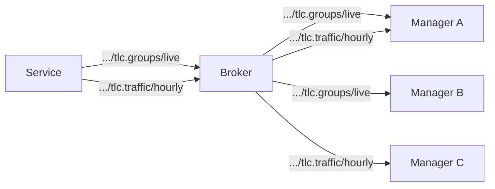

# Status
A node sends status messages to inform consumers about changes.

The type of status is identified by a status code.

Status data is delivered via channels. Every status code must define at least one channel.

A channel defines a deliver mechanism for a status, including:

- **Code**: module and status code, e.g. `tlc.groups`
- **Attributes**: which attributes to include, and their type (Send on Change or Send Along) and aggregation (sum, min, max, average, etc.)
- **Periodic interval**: interval for periodic updates
- **Event rate**: how event updates are triggered (on change, or at an interval)
- **Min interval**: minimum time between consecutive event publications
- **Batch interval**: optional interval for grouping multiple updates into a single message
- **Default state**: whether the channel starts automatically (on/off)
- **QoS**: MQTT quality of service level
- **Prune timeout**: auto-stop after consumers disappear

A node must have one or more channels configured for each status type. If all
channels for a status are stopped, no data is published for that status.

A status is not required to have any channel that defaults to on. Some data like high-frequency signal groups) may default to off and only be published when explicitly started by a consumer.



Multiple consumers benefit from the same published data without additional load on the device, thanks to MQTT's pub/sub fan-out.

## Topic Path

```
<node>/status/<code>/<channel>
```

When a status has only a single channel, the channel name may be omitted:

```
<node>/status/<code>
```

When the channel name is omitted in the status topic, it MUST also be omitted in the corresponding `channel`, `fetch`, and `history` topics.

Examples:
```
45fe/status/tlc.groups/live            # live channel of signal group status
45fe/status/tlc.groups/hourly          # hourly aggregated signal group status
45fe/status/tlc.plan                   # current plan (single channel, name omitted)
45fe/status/traffic.count/hourly       # hourly traffic data
```

Subscription patterns:
- `45fe/status/tlc.groups/#` — all channels for signal group status
- `45fe/status/#` — all status data for a device
- `+/status/#` — all status data from all devices

## Payload

The payload is CBOR encoded (represented here as JSON).

Every status message carries an `entries` array. A single-event message has
one entry; a batched message (when `batch_interval` is configured) has multiple.

```json
{
  "entries": [
    {
      "ts": "2026-02-24T10:00:00.000Z",
      "values": {"signalgroupstatus": "11111111", "cyclecounter": 42},
      "seq": 123
    },
    {
      "ts": "2026-02-24T10:00:02.000Z",
      "values": {"signalgroupstatus": "00000000", "cyclecounter": 44},
      "seq": 124
    }
  ]
}
```

| Field | Type | Description |
|---|---|---|
| `entries` | array | One or more event objects in this message |
| `ts` | ISO 8601 timestamp | The exact time the event occurred |
| `values` | object | Status attributes |
| `seq` | integer | Sequence number, incremented for each event |

The sequence number allows consumers to detect gaps (missed messages). The
sequence counter resets to zero when a channel is (re)started.

Channels without a `batch_interval` publish one entry per message. Channels
with a `batch_interval` accumulate events and flush them together, reducing
network overhead on constrained links.

## Attribute Types
Each attribute in a channel has a type that controls when it triggers publication:

### Send on Change (primary)
A change to this attribute triggers an event update. The update includes the
new value of this attribute plus the current values of all Send Along
attributes.

### Send Along (secondary)
This attribute is included in every update, but a change to its value alone
does NOT trigger an event.

This distinction is important for statuses that mix primary data with metadata.
For example, signal group status (S0001) includes:

| Attribute | Type | Why |
|---|---|---|
| `signalgroupstatus` | Send on Change | Main data — triggers updates on signal transitions |
| `stage` | Send on Change | Main data — triggers updates on stage changes |
| `cyclecounter` | Send Along | Metadata — provides timing context but shouldn't trigger updates alone |
| `basecyclecounter` | Send Along | Metadata — same as cyclecounter |

Without this distinction, the cyclecounter (which changes every second or faster)
would trigger continuous updates even when no signal groups have changed. With
it, cyclecounter values are only sent when meaningful — at the exact moment a
signal transition occurs, providing precise timing tied to the actual event.

## Periodic and Event Updates

### Periodic Updates
Periodic updates contain all attributes. They are generated:
- When the channel first starts
- Periodically according to the **periodic interval**

The periodic interval can be e.g. 1 minute, 15 minutes or 1 hour.
Fixed update windows should be aligned to clock boundaries (e.g. every 15
minutes on the quarter-hour).

### Event Updates
Event updates contain only attributes that actually changed, plus all Send
Along attributes.

For example, live data about signal groups of a traffic light controller could
use a periodic update once per minute, which sends the state of all groups,
and event updates that contain just the changed groups, generated immediately
when a group changes.

Event updates are triggered according to the **event rate**:
- **on_change**: generated immediately when a Send on Change attribute changes
- **interval**: generated at fixed intervals if any changes occurred

### Min Interval (Coalescing)
The **min interval** sets the minimum time between consecutive event
publications. Changes that occur within this window are coalesced into a single
event object. This prevents flooding during rapid state changes.

For example, setting `min_interval: 100ms` for signal group status means that
if three signal groups change within 100ms, a single event is generated
containing all three changes.

## Retention Rules

MQTT retained messages provide new subscribers with the immediate current
state of a channel. However, retaining a partial data set corrupts the
subscriber's view.

**The retention rule:** A message MAY ONLY be published with `retain = true`
if the payload represents a **complete data set** — it contains values for
*all* primary attributes defined for that channel.

1. **Periodic updates** always include all attributes, so they are complete
   data sets and SHOULD be retained.
2. **Event updates** typically contain only changed attributes and MUST be
   published with `retain = false`, *unless* the event happens to contain
   all primary attributes (e.g. the channel has only a single primary
   attribute), in which case it MAY be retained.
3. A message MAY be published with `retain = true` if and only if the *final*
   event in the `entries` array constitutes a complete data set.

## QoS

Each channel specifies an MQTT QoS level:

| QoS | Use case |
|---|---|
| 0 (at most once) | High-frequency data where occasional loss is acceptable (e.g. live signal groups) |
| 1 (at least once) | Data where loss is costly (e.g. aggregated traffic counts, alarms) |

## Aggregation
Each attribute can be aggregated over the channel periodic interval window:

- **sum**: total count over the window (e.g. vehicle count)
- **average**: mean over the window (e.g. speed)
- **median**: median over the window
- **max**: maximum over the window
- **min**: minimum over the window
- **count**: number of events in the window
- **std**: standard deviation over the window

Aggregated attributes are named with a suffix indicating the function, e.g. `vehicles.sum`, `speed.avg`, `speed.max`.

A channel may include multiple aggregated attributes over the same window.

Aggregated messages are published with MQTT `retain = true`. New consumers will receive the last published window immediately, and wait for the next window boundary for fresh data.

Aggregation windows MUST be aligned to clock boundaries (e.g. every 15 minutes on the quarter-hour). A node MUST NOT start publishing an aggregation channel mid-window — it MUST wait until the next window boundary.

## Default State
A channel configured as off by default MUST be started via a [Throttle](throttle.md)
message before it publishes data. A channel configured as on by default starts
publishing immediately after the node starts up.

High-frequency channels (e.g. live signal groups) should typically default to
off. Low-frequency channels (e.g. current plan, control mode) typically default
to on, but this is not required — a status may have all its channels default to
off if the data should only flow on demand.
