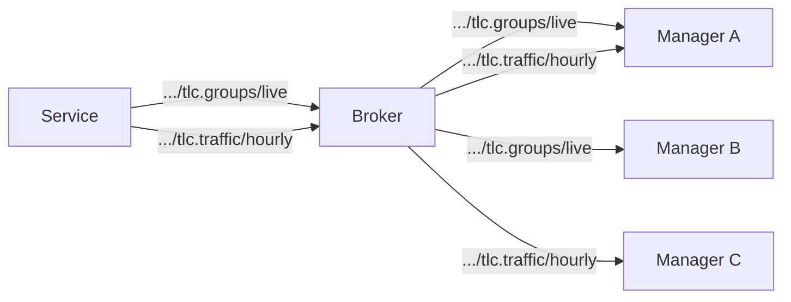

# Status

All status data is delivered exclusively via _channels_. Every status code must define at least one channel.

Channels can be configured with aggregation, rate
limiting, and on-demand activation.

A status is not required to have any channel that defaults to on — some data (e.g. high-frequency signal groups) may
only be published when explicitly started by a consumer.

A channel defines how a particular status is published, including:

- **Code**: module and status code, e.g. `tlc.groups`
- **Attributes**: which attributes to include, and their type (Send on Change or Send Along)
- **Update rate**: interval for periodic full updates (retained on the broker)
- **Delta rate**: how delta updates are triggered (on change, or at an interval)
- **Min interval**: minimum time between consecutive delta publications
- **Aggregation**: off, sum, count, average, median, max, min
- **Default state**: whether the channel starts automatically (on/off)
- **QoS**: MQTT quality of service level
- **Prune timeout**: auto-stop after consumers disappear

A node can have one or more channels configured for each status type. If all
channels for a status are stopped, no data is published for that status.




Multiple consumers benefit from the same published data without additional load on the device, thanks to MQTT's pub/sub fan-out.

## Topic Path

```
<node>/status/<code>/<channel>[/<component>]
```

When a status has only a single channel and no component segments, the channel name may be omitted:

```
<node>/status/<code>
```

The channel name **cannot** be omitted when component segments are present,
because the first segment after the code is always parsed as the channel name.
This ensures unambiguous topic parsing without requiring schema knowledge.

Examples:
```
45fe/status/tlc.groups/live            # live channel of signal group status
45fe/status/tlc.groups/hourly          # hourly aggregated signal group status
45fe/status/tlc.plan                   # current plan (single channel, name omitted)
45fe/status/traffic.count/hourly/dl/1  # hourly traffic data for detector logic 1
```

Invalid:
```
45fe/status/traffic.count/dl/1         # WRONG — "dl" would be parsed as channel name
```

Subscription patterns:
- `45fe/status/tlc.groups/#` — all channels for signal group status
- `45fe/status/#` — all status data for a device
- `+/status/#` — all status data from all devices

## Attribute Types

Each attribute in a channel has a type that controls when it triggers publication:

### Send on Change (primary)
A change to this attribute triggers publication of a delta update. The update
includes the new value of this attribute plus the current values of all Send
Along attributes.

### Send Along (secondary)
This attribute is included in every update, but a change to its value alone
does NOT trigger publication.

This distinction is important for statuses that mix primary data with metadata.
For example, signal group status (S0001) includes:

| Attribute | Type | Why |
|---|---|---|
| `signalgroupstatus` | Send on Change | Main data — triggers updates on signal transitions |
| `stage` | Send on Change | Main data — triggers updates on stage changes |
| `cyclecounter` | Send Along | Metadata — provides timing context but shouldn't trigger updates alone |
| `basecyclecounter` | Send Along | Metadata — same as cyclecounter |

Without this distinction, the cyclecounter (which changes every second or faster)
would trigger continuous updates even when no signal groups have changed. With
it, cyclecounter values are only sent when meaningful — at the exact moment a
signal transition occurs, providing precise timing tied to the actual event.

## Full and Delta Updates

### Full Updates
Full updates contain all attributes and are published with MQTT `retain = true`.
They are sent:
- When the channel first starts
- Periodically according to the **update rate**

New subscribers immediately receive the latest full update from the broker's
retained message store.

### Delta Updates
Delta updates contain only the Send on Change attributes that actually changed,
plus all Send Along attributes. They are published with MQTT `retain = false`.

Delta updates are triggered according to the **delta rate**:
- **on_change**: published immediately when a Send on Change attribute changes
- **interval**: published at fixed intervals if any changes occurred

### Min Interval
The **min interval** sets the minimum time between consecutive delta
publications. Changes that occur within this window are coalesced into a single
update. This prevents flooding during rapid state changes.

For example, setting `min_interval: 100ms` for signal group status means that
if three signal groups change within 100ms, a single delta is sent.

## QoS

Each channel specifies an MQTT QoS level:

| QoS | Use case |
|---|---|
| 0 (at most once) | High-frequency data where occasional loss is acceptable (e.g. live signal groups) |
| 1 (at least once) | Data where loss is costly (e.g. aggregated traffic counts, alarms) |

## Aggregation

Channels can aggregate data over time windows:

- **sum**: total count over the window (e.g. vehicle count)
- **average**: mean over the window (e.g. speed)
- **median**: median over the window
- **max**: maximum over the window
- **min**: minimum over the window
- **count**: number of events in the window

Aggregation windows should be aligned to clock boundaries (e.g. every 15
minutes on the quarter-hour). Messages include a `partial` flag when an
aggregation window was incomplete (e.g. at channel start or stop).

## Default State
A channel configured as off by default MUST be started via a [Throttle](throttle.md)
message before it publishes data. A channel configured as on by default starts
publishing immediately after the node starts up.

High-frequency channels (e.g. live signal groups) should typically default to
off. Low-frequency channels (e.g. current plan, control mode) typically default
to on, but this is not required — a status may have all its channels default to
off if the data should only flow on demand.

## Sequence Numbers
Each status message includes a sequence number, incremented for each
publication. This allows consumers to detect gaps (missed messages) when using
QoS 0. The sequence counter resets when a channel is (re)started.

## MQTT 5 Features

- **Message Expiry Interval**: full updates expire after 2× the update rate,
  preventing stale retained messages if a device goes offline.
- **Topic Aliases**: reduce per-message overhead for high-frequency topics.
