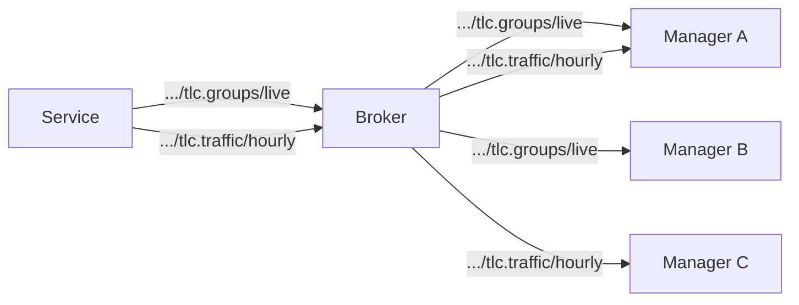
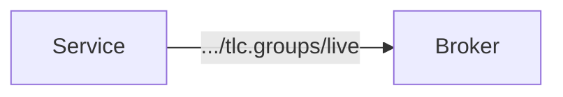
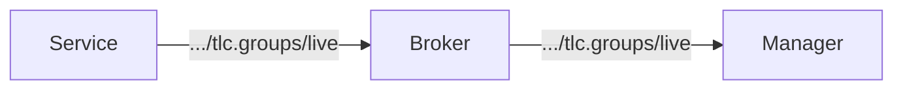

# Streams
All status data is delivered exclusively via _streams_. There is no separate
"raw status" mechanism — streams are the only way status reaches the broker.

Every status code must define at least one stream. A minimal stream configured
with Send on Change and default on behaves like a traditional RSMP 3 status
subscription. More advanced streams add features like aggregation, rate
limiting, and on-demand activation. A status is not required to have any
stream that defaults to on — some data (e.g. high-frequency signal groups) may
only be published when explicitly started by a consumer.

A stream defines how a particular status is published, including:

- **Code**: module and status code, e.g. `tlc.groups`
- **Attributes**: which attributes to include, and their type (Send on Change or Send Along)
- **Update rate**: interval for periodic full updates (retained on the broker)
- **Delta rate**: how delta updates are triggered (on change, or at an interval)
- **Min interval**: minimum time between consecutive delta publications
- **Aggregation**: off, sum, count, average, median, max, min
- **Default state**: whether the stream starts automatically (on/off)
- **QoS**: MQTT quality of service level
- **Prune timeout**: auto-stop after consumers disappear

A node can have one or more streams configured for each status type. If all
streams for a status are stopped, no data is published for that status.

Unlike RSMP 3, you don't specify subscription settings when you start fetching
data. Instead you choose between the already defined streams by subscribing to
the appropriate topic.



Multiple consumers benefit from the same published data without additional load on the device, thanks to MQTT's pub/sub fan-out.

## Data Topic Paths
Stream data is published to RSMP 4 status topic paths with the stream name as
an additional level after the code:

```
<node>/status/<code>/<stream>[/<component>]
```

When a status has only a single stream and no component segments, the stream
name may be omitted:

```
<node>/status/<code>
```

The stream name **cannot** be omitted when component segments are present,
because the first segment after the code is always parsed as the stream name.
This ensures unambiguous topic parsing without requiring schema knowledge.

Examples:
```
45fe/status/tlc.groups/live          # live stream of signal group status
45fe/status/tlc.groups/hourly        # hourly aggregated signal group status
45fe/status/tlc.plan                 # current plan (single stream, name omitted)
45fe/status/traffic.count/hourly/dl/1  # hourly traffic data for detector logic 1
```

Invalid:
```
45fe/status/traffic.count/dl/1       # WRONG — "dl" would be parsed as stream name
```

This layout allows flexible subscription patterns:
- `45fe/status/tlc.groups/#` — all streams for signal group status
- `45fe/status/#` — all status streams for a device
- `+/+/+/status/#` — all statuses from all devices

## Stream State Topic Paths
Stream lifecycle/state updates are published on dedicated stream topics:

```
<node>/stream/<code>/<stream>
```

Examples:
```
45fe/stream/tlc.groups/live          # live stream state
45fe/stream/tlc.groups/hourly        # hourly stream state
```

Payload is explicitly defined as:

```json
{"state": "running" | "stopped"}
```

Rules:
- The payload MUST include exactly one key: `state`.
- `state` MUST be one of: `running`, `stopped`.
- No additional payload keys are currently defined for this topic.

These messages are published with MQTT `retain = true` and `qos = 1`.

Subscription patterns:
- `45fe/stream/#` — all stream states for a device
- `45fe/stream/tlc.groups/#` — all stream states for signal group status
- `+/+/+/stream/#` — all stream states from all devices

## Receiving Data
To receive data the stream must be running and you must be subscribed to the
associated topic path.

Starting and stopping a stream controls whether data is published to the
broker. If a stream is configured as on by default, you don't need to
manually start it.

Starting and stopping a stream also updates the retained stream state topic.

Subscribing to the topic path controls whether you receive data from the broker.

## Starting and Stopping
When you start a stream, it starts publishing data to broker,
even if nobody has yet subscribed to the relevant topic path:



Consumers must be subscribed to the relevant topic path to receive data from the broker:



When you stop a stream, data is no longer published to the broker. Consumers
will no longer receive data, even if they are still subscribed to the topic.

When a stream is stopped, the device publishes an empty retained message to
clear stale data from the broker.

Stream control is done via RSMP 4 throttle topics:

```
<node>/throttle/<code>/<stream>  →  {"action": "start" | "stop"}
```

Examples:

```
45fe/throttle/tlc.groups/live     →  {"action": "start"}
45fe/throttle/tlc.groups/live     →  {"action": "stop"}
45fe/throttle/tlc.plan/default    →  {"action": "start"}
```

When a node connects, it republishes stream state for all configured streams to
their `<node>/stream/<code>/<stream>` topics. This lets supervisors recover the
current stream state immediately from retained messages.

## Attribute Types

Each attribute in a stream has a type that controls when it triggers publication:

### Send on Change (primary)
A change to this attribute triggers publication of a delta update. The update
includes the new value of this attribute plus the current values of all Send
Along attributes.

### Send Along (secondary)
This attribute is included in every update, but a change to its value alone
does NOT trigger publication.

This distinction is important for statuses that mix primary data with metadata.
For example, signal group status (S0001) includes:

| Attribute | Type | Why |
|---|---|---|
| `signalgroupstatus` | Send on Change | Main data — triggers updates on signal transitions |
| `stage` | Send on Change | Main data — triggers updates on stage changes |
| `cyclecounter` | Send Along | Metadata — provides timing context but shouldn't trigger updates alone |
| `basecyclecounter` | Send Along | Metadata — same as cyclecounter |

Without this distinction, the cyclecounter (which changes every second or faster)
would trigger continuous updates even when no signal groups have changed. With
it, cyclecounter values are only sent when meaningful — at the exact moment a
signal transition occurs, providing precise timing tied to the actual event.

## Full and Delta Updates

### Full Updates
Full updates contain all attributes and are published with MQTT `retain = true`.
They are sent:
- When the stream first starts
- Periodically according to the **update rate**

New subscribers immediately receive the latest full update from the broker's
retained message store.

### Delta Updates
Delta updates contain only the Send on Change attributes that actually changed,
plus all Send Along attributes. They are published with MQTT `retain = false`.

Delta updates are triggered according to the **delta rate**:
- **on_change**: published immediately when a Send on Change attribute changes
- **interval**: published at fixed intervals if any changes occurred

### Min Interval
The **min interval** sets the minimum time between consecutive delta
publications. Changes that occur within this window are coalesced into a single
update. This prevents flooding during rapid state changes.

For example, setting `min_interval: 100ms` for signal group status means that
if three signal groups change within 100ms, a single delta is sent.

## QoS

Each stream specifies an MQTT QoS level:

| QoS | Use case |
|---|---|
| 0 (at most once) | High-frequency data where occasional loss is acceptable (e.g. live signal groups) |
| 1 (at least once) | Data where loss is costly (e.g. aggregated traffic counts, alarms) |

## Aggregation

Streams can aggregate data over time windows:

- **sum**: total count over the window (e.g. vehicle count)
- **average**: mean over the window (e.g. speed)
- **median**: median over the window
- **max**: maximum over the window
- **min**: minimum over the window
- **count**: number of events in the window

Aggregation windows should be aligned to clock boundaries (e.g. every 15
minutes on the quarter-hour). Messages include a `partial` flag when an
aggregation window was incomplete (e.g. at stream start or stop).

## Default State
A stream configured as off by default must be started before it publishes data.
A stream configured as on by default starts publishing immediately after the
node starts up.

High-frequency streams (e.g. live signal groups) should typically default to
off. Low-frequency streams (e.g. current plan, control mode) typically default
to on, but this is not required — a status may have all its streams default to
off if the data should only flow on demand.

## Stream State Discovery
Supervisors discover current stream states by subscribing to retained stream
topics:

```
<node>/stream/#
```

Because stream state messages are retained, a subscriber immediately receives
the latest known state for each stream.

## Pruning
Streams can be configured to automatically stop when consumers disappear, or
have been offline for a predefined period.

This is useful for streams that consume significant bandwidth. Automatic
stopping is based on the `presence` message, which informs the node when other
nodes go online/offline.

When all known consumers go offline, a prune timer starts. If no consumer
comes back within the prune timeout, the stream is stopped and retained data
is cleared from the broker.

## Sequence Numbers
Each stream message includes a sequence number, incremented for each
publication. This allows consumers to detect gaps (missed messages) when using
QoS 0. The sequence counter resets when a stream is (re)started.

## MQTT 5 Features
Streams leverage MQTT 5 features:

- **Message Expiry Interval**: full updates expire after 2× the update rate,
  preventing stale retained messages if a device goes offline.
- **Topic Aliases**: reduce per-message overhead for high-frequency topics.

