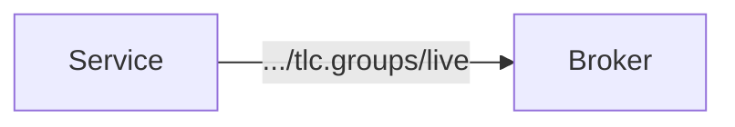
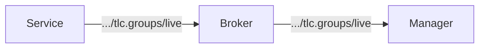

# Throttle
Throttle messages control channel runtime state (start/stop) for a specific
channel on a node.

```
<node>/throttle/<code>/<channel>
```

Examples:
```
45fe/throttle/tlc.groups/live      # start/stop live signal group channel
45fe/throttle/traffic.volume/5s    # start/stop 5s traffic channel
```

For single-channel statuses, `default` can be used as channel name:

```
45fe/throttle/tlc.plan/default
```

Payload (CBOR encoded JSON):

```json
{"action": "start" | "stop", "timeout": <seconds>}
```

Rules:
- The payload MUST include the key `action`.
- `action` MUST be one of: `start`, `stop`.
- `timeout` is optional and MUST only be used with `action: "start"`.
- `timeout` specifies the number of seconds after which the channel stops automatically.
- If `timeout` is omitted, the channel runs until explicitly stopped.

## MQTT Behavior
- QoS: `1`
- Retain: `false`

Throttle commands trigger channel state updates on corresponding channel topics:

```
<node>/channel/<code>/<channel>
```

## Behavior

To receive status data, the channel must be running and the consumer must be
subscribed to the associated status topic path.

Starting a channel causes the node to begin publishing data to the broker,
even if no consumers are yet subscribed:



Consumers subscribe to the status topic path to receive data from the broker:



Stopping a channel causes the node to stop publishing. Consumers will no longer
receive data even if they remain subscribed. The node publishes an empty retained
message to clear stale data from the broker.

When a node connects, it MUST republish the current channel state for all
configured channels to their `<node>/channel/<code>/<channel>` topics, so
supervisors can recover state immediately from retained messages.
